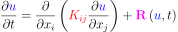

========================================
CellML Split Reaction Diffusion Equation
========================================

This example solves the weak form of the one-dimensional reaction diffusion equation using the Galerkin finite element method. The classical form of the governing equation in three-dimension is given by,  

|3d_reaction_diffusion_equation|

where |u| is a scalar dependent variable (e.g. temperature, concentration of a chemical species), |conductivity_tensor| is a rank-two diffusion tensor, |R| is the reaction term (function of the dependent variable |u|) and |x| and |t| are spatial coordinates and time respectively.

The reaction term is obtained by solving an odinary differential equation (ODE) which describes the rate of generation or depletion of at 

   :align: middle

.. |u| image:: ./docs/images/u.svg
   :align: bottom

.. |conductivity_tensor| image:: ./docs/images/conductivity_tensor.svg
   :align: bottom

   :align: bottom

.. |x| image:: ./docs/images/x.svg
   :align: bottom
   
.. |t| image:: ./docs/images/t.svg
   :align: bottom   
   
   
   

Building the example
====================

The fortran version of the example can be configured and built with CMake::

  git clone https://github.com/OpenCMISS-Examples/cellml_split_reaction_diffusion_equation
  mkdir cellml_split_reaction_diffusion_equation-build
  cd cellml_split_reaction_diffusion_equation-build
  cmake -DOpenCMISSLibs_DIR=/path/to/opencmisslib/install ../cellml_split_reaction_diffusion_equation
  make

This will create the example executable "cellml_split_reaction_diffusion_equation" in ./src/fortran/ directory.

Running the example
===================

Fortran version::

  cd ./src/fortran/
  ./cellml_split_reaction_diffusion_equation

Verifying the example
=====================

Results can be visualised by running `visualise.cmgui <./src/fortran/visualise.cmgui>`_ with the `Cmgui visualiser <http://physiomeproject.org/software/opencmiss/cmgui/download>`_.

The following figure shows the solutions and various field variables ........... 

The expected results from this example are available in `expected_results <./src/fortran/expected_results>`_ folder.  

Prerequisites
=============

As stated, the ODE that determines the source/reaction term is solved using CellML. The ODE model is input via `zero-rate.xml <./src/fortran/zero-rate.xml>`_.

License
=======

License applicable to this example is described in `LICENSE <./LICENSE>`_.

